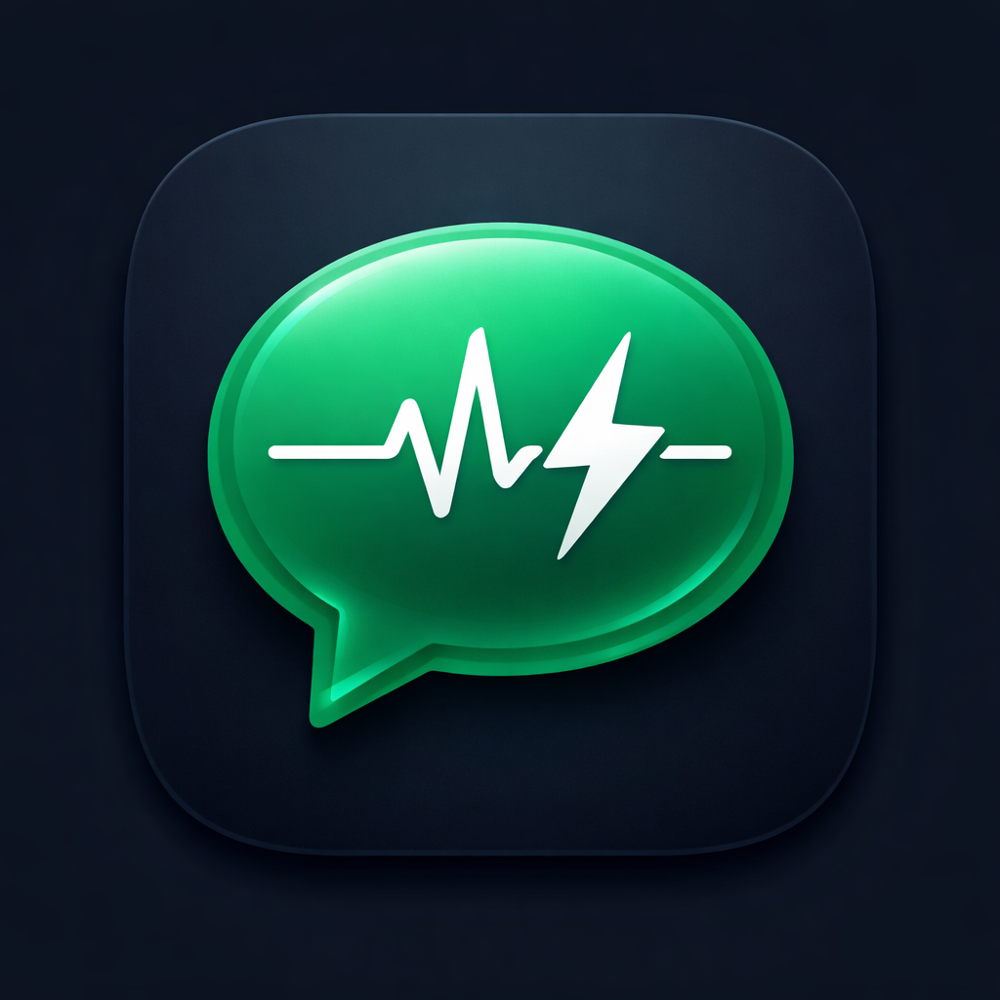

# Modern Messaging App

## Objective

Design a cross-platform messaging application inspired by Meta Messenger to demonstrate skills at the following:

- Real-time communication
- User authentication
- Modern UI/UX implementation
- Secure environment configuration and deployment

_Note to Maui:_ This requirements document has been modified to cater towards mobile development instead of web development to align it with my upcoming OJT as we discussed in-person some months ago. I thought to align the tech stack for my upcoming OJT to both better prepare for my OJT and finish a requirement from ALPHA. Two birds one stone, pretty much. Hehe.

Scan to launch with Expo Go

## Tech Stack

- React Native
- TypeScript
- Expo
- Firebase

## Core

### Key Features

- [x] Real-time 1-on-1 and group messaging
- [x] Typing indicators with online/offline status
- [x] Message reactions, replies, and forwarding
- [x] Image, file, and voice message support
- [x] User profiles, friend requests, search
- [x] Notifications and chat list unread counts
- [x] Dark/light theme toggle

### Deliverables

- [x] Project repository on GitHub
- [x] `requirements.md` and `design.md` files
- [x] Live deployed application with Expo link
- [x] Submit to Current Head Dev (Maui)

### Documentation

- [`requirements.md`](docs/requirements.md)
- [`design.md`](docs/design.md)
